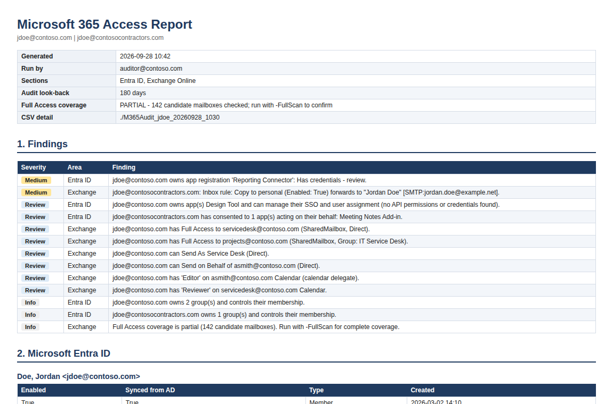

# 365-AccessAudit

Answer **"what can this person access in Microsoft 365?"** with one read-only PowerShell script and an HTML report.

Access reviews, role changes, contractor-to-employee conversions and offboarding all need the same answer, and Microsoft 365 doesn't have a single place that gives it. Entra ID roles live in one portal, app assignments in another, and Exchange permissions are stored on the *mailboxes*, not on the user, so there's no screen that lists what one user can open. In practice people check a few obvious places and miss the rest: the app registration they own, the shared mailbox they reach through a group, the executive whose calendar they manage.

This script checks all of it, rates what it finds, and writes a report you can hand to a manager or attach to a ticket. It only reads. It changes nothing.



---

## What it checks

| Area | Checks |
|---|---|
| **Entra ID** | Group memberships (nested), directory roles (active and PIM-eligible, direct or via group), enterprise app assignments with role and granting group, OAuth consents, owned objects |
| **Owned apps** | API application permissions and secrets/certificates on every app the user owns, with a risk flag |
| **Exchange admin** | Admin role assignments beyond the defaults, role group memberships |
| **Mailbox access** | Full Access, Send As, Send on Behalf, calendar/inbox folder permissions and delegation, Microsoft 365 group mailboxes, including access granted through groups |
| **Own mailbox** | Mailbox forwarding and forwarding inbox rules |
| **Audit log** | Permission changes naming the user, and the user's activity in other mailboxes |

Several accounts can be audited as one person, for example an employee account and a contractor account, so group-based and duplicated access shows up in one report.

---

## Architecture

```
            ┌──────────────── Entra ID (Graph, per account) ────────────────┐
 -Users ──► │ user → groups → roles → apps → OAuth → owned objects → app risk │ ──┐
            └─────────────────────────────────────────────────────────────────┘   │ group identities
                                                                                   ▼
            ┌──────────────── Exchange Online (all accounts) ───────────────────────────────┐
            │ admin roles → forwarding → audit: changes → audit: activity → candidates       │
            │   → verify Full Access / folders / Send on Behalf → [full scan] → Send As      │
            └────────────────────────────────────────────────────────────────────────────────┘
                                                   │
                                                   ▼
                         CSV per check  +  Summary.txt  +  HTML report with findings
```

The Entra section feeds the Exchange section: every group the user belongs to becomes an identity to match against mailbox permissions, which is how access granted through groups is caught.

---

## Why the Full Access check works the way it does

This is the part that decides how long the script takes, so it's worth explaining.

| Approach | Cost | Coverage |
|---|---|---|
| Check every mailbox | Hours in a large tenant. One permission read per mailbox, and no reverse lookup exists. | Complete |
| Read the user's `msExchDelegateListBL` in AD | Seconds | Only automapped grants. Misses group grants, grants without automapping, and cloud-only changes. |
| **Candidate list, then verify** (default) | Minutes | Everything the audit log, shared mailboxes and automapping point to |

By default the script builds a candidate list from the audit log (grants that name the user, mailboxes the user was active in), every shared/room/equipment mailbox, and AD automapping links, then checks **current** permissions on each. The report states whether coverage was **COMPLETE** or **PARTIAL**. `-FullScan` checks everything the candidate pass skipped, for when you need proof.

Details in [`docs/HOW-IT-WORKS.md`](docs/HOW-IT-WORKS.md).

---

## Repository contents

```
├── Get-M365AccessAudit.ps1          The script
├── docs/
│   ├── SETUP.md                     Modules, roles, Graph consent, first run
│   ├── HOW-IT-WORKS.md              Every check, the Full Access strategy, audit searches
│   ├── INTERPRETING-RESULTS.md      Severity, each output file, common patterns
│   └── TROUBLESHOOTING.md           Every error seen so far and its fix
├── examples/
│   ├── sample-report.html           Full report for a fictional Contoso user
│   ├── sample-report.png            Screenshot used above
│   ├── sample-Summary.txt
│   └── csv/                         Sample output files
└── LICENSE
```

All example data is fictional.

---

## Prerequisites

- **PowerShell 7** on Windows, macOS or Linux.
- **Microsoft.Graph** and **ExchangeOnlineManagement** modules.
- **Global Reader** for the account running it.
- **View-Only Audit Logs** for the audit steps (Purview **Audit Reader** role group). Optional: without it those steps are skipped with a warning.
- Entra ID P2 is **not** required. PIM checks run only when the tenant has it.

---

## Quick start

```powershell
Install-Module Microsoft.Graph -Scope CurrentUser
Install-Module ExchangeOnlineManagement -Scope CurrentUser

./Get-M365AccessAudit.ps1 -Users jdoe@contoso.com
```

Run it in a **new** PowerShell window. Sign in once for Graph and once for Exchange Online. The HTML report is written next to the script; CSV detail goes to a timestamped folder.

| Parameter | Purpose |
|---|---|
| `-Users` | Account(s) to audit, comma-separated. Prompted for if omitted. |
| `-FullScan` | Check every mailbox for Full Access. Slow, but complete. |
| `-Days` | Audit log look-back (default 180). |
| `-SkipSharedMailboxes` | Don't add all shared/room/equipment mailboxes to the candidate list. |
| `-SkipGraph` / `-SkipExchange` | Run one section only. Skipping Graph disables group-based matching in Exchange. |
| `-GraphVersion` | Force a Graph module version (auto-detected by default). |
| `-OutFolder` | Folder for CSV detail. |
| `-ReportFolder` | Folder for the HTML report (default: the script's folder). |

```powershell
# Employee and contractor accounts for the same person, complete mailbox coverage
./Get-M365AccessAudit.ps1 -Users jdoe@contoso.com, jdoe@contosocontractors.com -FullScan
```

Full walkthrough in [`docs/SETUP.md`](docs/SETUP.md).

---

## Three things that will bite you

**Mixed Graph module versions.** `Install-Module Microsoft.Graph` installs about forty sub-modules, and updating one pulls in a newer `Microsoft.Graph.Authentication` than the rest expect. The result is `Assembly with same name is already loaded`, and nothing in that session can fix it. The script detects a version common to the four modules it needs and pins them, but if your install is mixed you still need a fresh window and possibly `Update-Module Microsoft.Graph -Force`. See [`docs/TROUBLESHOOTING.md`](docs/TROUBLESHOOTING.md#graph-modules).

**Default coverage is partial by design.** The candidate check is fast because it doesn't read every mailbox. Full Access on an ordinary user mailbox, granted before the audit window and never used since, won't be found without `-FullScan`. The report says **PARTIAL** when that's the case; don't present a partial run as proof of absence.

**The audit log only goes back so far.** Audit (Standard) retains 180 days. Anything granted or used before that is invisible to the audit steps, which is why the shared-mailbox check and `-FullScan` exist. And without the View-Only Audit Logs role, the audit steps are skipped entirely.

---

## A note on what "access" means here

The report shows what a user **can** do, rated by what that access allows. It doesn't judge whether access is appropriate. That depends on the person's job, which the script can't know. Full Access to the service desk mailbox is expected for a service desk analyst and worth a question for anyone else.

Where it can, the report pairs permissions with evidence of use from the audit log. Access that exists but is never used is often the easiest to remove. See [`docs/INTERPRETING-RESULTS.md`](docs/INTERPRETING-RESULTS.md).

---

## Limitations

- **Microsoft 365 only.** Not covered: on-premises Active Directory, SharePoint and OneDrive site permissions, file shares, Azure RBAC, Teams private channels, and roles inside third-party SaaS apps.
- **Folder permissions are targeted.** Root, Calendar and Inbox are checked only on mailboxes the audit log or automapping points to.
- **Group matching needs Graph.** Access granted through groups is matched using the group list from the Entra section.
- **Point in time.** The report reflects permissions at the moment it ran.

---

## Security

Output contains real account and permission data. The `.gitignore` excludes CSVs, reports and output folders; keep audit results out of any repository.

---

## License

MIT, see [LICENSE](LICENSE).

Not affiliated with or endorsed by Microsoft. "Microsoft," "Microsoft 365," "Entra," "Exchange Online" and "Microsoft Graph" are trademarks of Microsoft Corporation.
